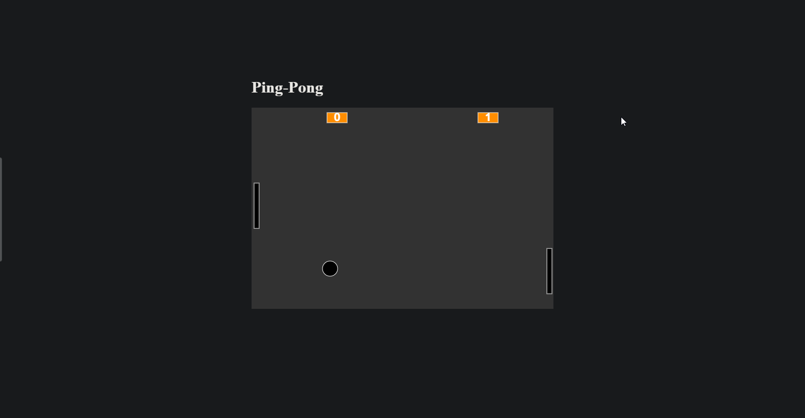

# Pong

É sempre bom da uma revisada boa em lógica de programação e esse processo fica melhor na criação de jogos 🎮. Com a plataforma da Alura junto com o orientado Guilherme Lima refiz o “Pong” do Atari.

Para deixa o processo de criação mais prático foi usado a lib p5.js. que facilita bastante as configuração da colisão e a criação das formas geométricas no canvas.

Caso queiram da uma olhada no jogo, só clicar aqui: https://lnkd.in/gWa8H6tB

Projeto da Alura de jogos clássicos. 

## Preview 

